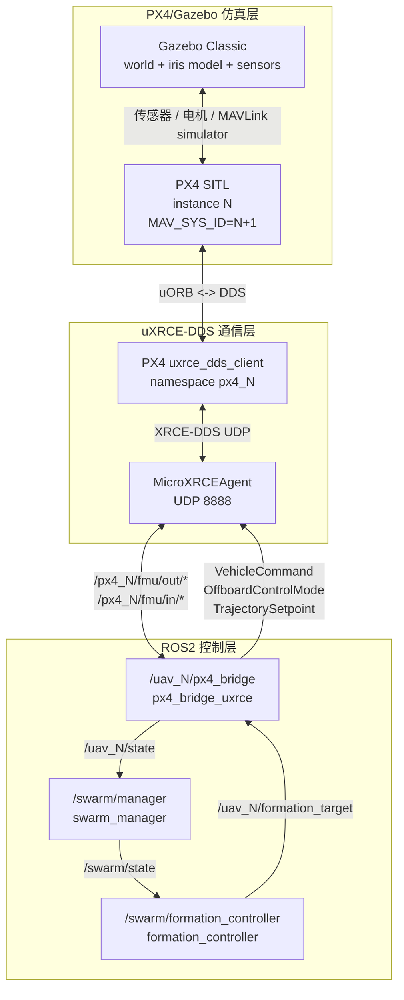
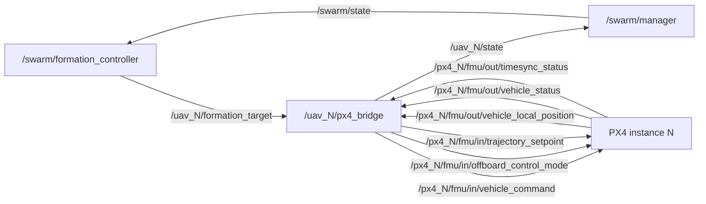
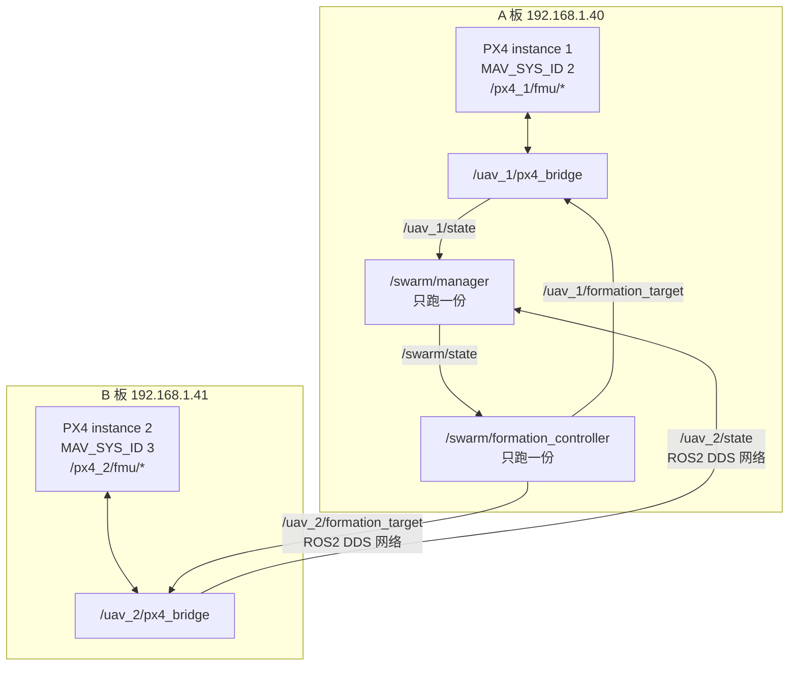

# 控制流和节点接口说明

本文回答几个容易混淆的问题：

- `/px4_N/fmu/*` 这种 topic 是谁生成的。
- `PX4_INSTANCE_START` 和 ROS2 `instance_start` 的区别。
- 当前 launch 文件为什么放在 `formation_controller` 包下，后续是否应该拆成独立 bringup 包。
- `px4_bridge_uxrce` 到底订阅、发布、提供哪些服务。
- 为什么需要 `swarm_manager` 汇总状态，而不是让 `formation_controller` 直接订阅所有无人机。

## 1. 总体控制流

当前真实 PX4 主线是：

```text
Gazebo Classic
  负责虚拟世界、物理、模型、传感器、电机动力学

PX4 SITL
  负责飞控、状态估计、控制器、模式、failsafe、MAVLink、uXRCE-DDS client

MicroXRCEAgent
  负责把 PX4 uXRCE-DDS client 接入 ROS2 DDS graph

px4_bridge_uxrce
  每架飞机一个实例，把 PX4 DDS topic 翻译成项目内部 /uav_N 接口

swarm_manager
  汇总 /uav_N/state，发布 /swarm/state

formation_controller
  读取 /swarm/state，计算 /uav_N/formation_target
```

核心闭环：



单架飞机的数据路径：

```text
PX4 telemetry
  -> /px4_N/fmu/out/vehicle_local_position
  -> /uav_N/px4_bridge
  -> /uav_N/state
  -> /swarm/manager
  -> /swarm/state
  -> /swarm/formation_controller
  -> /uav_N/formation_target
  -> /uav_N/px4_bridge
  -> /px4_N/fmu/in/trajectory_setpoint
  -> PX4 Offboard
  -> Gazebo 飞机运动
```

## 2. `/px4_N/fmu/*` 是谁生成的

`/px4_N/fmu/*` 不是本项目随便起的名字，也不是 `swarm_px4_uxrce.launch.py` 直接生成的 topic。

它来自 PX4 v1.14.4 的 uXRCE-DDS client：

1. PX4 内部 `dds_topics.yaml` 定义基础 topic：

   ```text
   /fmu/out/vehicle_local_position
   /fmu/out/vehicle_status
   /fmu/out/timesync_status
   /fmu/in/vehicle_command
   /fmu/in/offboard_control_mode
   /fmu/in/trajectory_setpoint
   ...
   ```

2. PX4 SITL 启动脚本根据 `px4_instance` 给 uXRCE-DDS client 加 namespace：

   ```sh
   if [ "$px4_instance" -ne "0" ]
   then
       uxrce_dds_ns="-n px4_$px4_instance"
   fi
   uxrce_dds_client start -t udp -h 127.0.0.1 -p 8888 $uxrce_dds_ns
   ```

3. 因此多实例 SITL 中：

   ```text
   PX4 instance 1 + /fmu/out/... -> /px4_1/fmu/out/...
   PX4 instance 2 + /fmu/out/... -> /px4_2/fmu/out/...
   PX4 instance 3 + /fmu/out/... -> /px4_3/fmu/out/...
   ```

本项目的 `px4_bridge_uxrce` 只是通过参数 `px4_topic_prefix` 选择要连接哪个 PX4 namespace：

```yaml
px4_topic_prefix: px4_2
```

会被 bridge 标准化成：

```text
/px4_2
```

然后拼接成：

```text
/px4_2/fmu/out/vehicle_local_position
/px4_2/fmu/in/trajectory_setpoint
```

所以准确说：

```text
PX4 生成 /fmu/in 和 /fmu/out 的基础 topic。
PX4 rcS 用 -n px4_N 给这些 topic 加 namespace。
MicroXRCEAgent 把这些 DDS topic 接到 ROS2。
本项目 bridge 只选择并使用这些 topic。
```

## 3. `PX4_INSTANCE_START` 和 ROS2 `instance_start`

这两个名字相似，但处在不同层。

### `PX4_INSTANCE_START`

位置：

```text
scripts/start_px4_multi_sitl.sh
```

作用：

```text
决定实际启动哪个 PX4 SITL instance。
```

例如：

```bash
PX4_INSTANCE_START=2 ./scripts/start_px4_multi_sitl.sh 1 iris
```

实际启动：

```text
PX4 instance 2
MAV_SYS_ID 3
/px4_2/fmu/*
```

它影响：

- PX4 instance 编号
- PX4 rootfs 目录
- Gazebo 模型通信端口
- `MAV_SYS_ID`
- `UXRCE_DDS_KEY`
- `/px4_N/fmu/*` topic namespace

### ROS2 `instance_start`

位置：

```text
ros2_ws/src/swarm_bringup/launch/swarm_px4_uxrce.launch.py
```

作用：

```text
决定 ROS2 生成哪个 /uav_N/px4_bridge，并让它连接哪个 /px4_N/fmu/*。
```

例如：

```bash
ros2 launch swarm_bringup swarm_px4_uxrce.launch.py \
  instance_start:=2 vehicle_count:=1
```

会生成：

```text
/uav_2/px4_bridge
drone_id: uav_2
system_id: 3
px4_topic_prefix: px4_2
```

### 必须对齐

正确：

```text
PX4_INSTANCE_START=2
ROS2 instance_start:=2
```

得到：

```text
PX4 instance 2
/px4_2/fmu/*
/uav_2/px4_bridge
MAV_SYS_ID 3
```

错误：

```text
PX4_INSTANCE_START=2
ROS2 instance_start:=1
```

会变成：

```text
实际飞机在 /px4_2
ROS2 bridge 去控制 /px4_1
```

结果就是 B 板 QGC 能看到飞机，但 ROS2 控制不到它。

## 4. launch 文件为什么放在 `swarm_bringup`

当前主 launch 文件：

```text
ros2_ws/src/swarm_bringup/launch/swarm_px4_uxrce.launch.py
ros2_ws/src/swarm_bringup/launch/swarm_mock.launch.py
```

这些文件现在放在独立的 `swarm_bringup` 包下。它的职责是组合启动整个系统，而不是实现某个单独功能节点。

`swarm_px4_uxrce.launch.py` 实际负责启动的是：

```text
px4_bridge_uxrce
swarm_manager
formation_controller
```

所以它不应该属于 `formation_controller`、`swarm_manager` 或 `px4_bridge_uxrce` 中任意一个功能包。当前结构是：

```text
ros2_ws/src/
  px4_bridge_uxrce/
    src/px4_uxrce_bridge_node.cpp

  swarm_manager/
    swarm_manager/swarm_manager_node.py

  formation_controller/
    src/formation_controller_node.cpp

  swarm_bringup/
    package.xml
    CMakeLists.txt
    launch/
      swarm_px4_uxrce.launch.py
      swarm_mock.launch.py
    config/  # install 后包含 swarm.yaml / formations.yaml / waypoints.yaml
```

职责划分会更清楚：

```text
px4_bridge_uxrce       只负责单机 PX4 通信节点
swarm_manager          只负责状态汇总节点
formation_controller   只负责编队控制节点
swarm_bringup          负责组合启动整个系统
```

历史说明：

```text
早期系统级 launch 曾放在 formation_controller 包下，原因是当时主要验证 formation_controller。
现在已迁移到 swarm_bringup，formation_controller 回归为纯控制器包。
```

## 5. `px4_bridge_uxrce` 详细接口

文件：

```text
ros2_ws/src/px4_bridge_uxrce/src/px4_uxrce_bridge_node.cpp
```

节点名：

```text
px4_uxrce_bridge
```

launch 放入 namespace 后实际节点名：

```text
/uav_1/px4_bridge
/uav_2/px4_bridge
```

### 参数

| 参数 | 作用 |
|---|---|
| `drone_id` | 项目内部无人机 ID，例如 `uav_1` |
| `drone_namespace` | ROS2 namespace，例如 `uav_1` |
| `role` | `leader` / `follower` |
| `frame_id` | 当前为 `local_enu` |
| `px4_topic_prefix` | PX4 DDS 前缀，例如 `px4_1`，内部会变成 `/px4_1` |
| `system_id` | MAVLink/PX4 system id，例如 `2` |
| `takeoff_altitude_m` | takeoff 服务使用的起飞高度 |
| `state_rate_hz` | `/uav_N/state` 发布频率 |
| `offboard_rate_hz` | Offboard setpoint 发布频率 |
| `enable_offboard_from_target` | 收到 active target 后是否自动开始 Offboard setpoint 流 |
| `offboard_warmup_cycles` | 切 Offboard 前预热 setpoint 周期数 |
| `initial_position` | 把 PX4 local NED 对齐到项目 local ENU 的锚点 |

### 订阅

| Topic | Type | 作用 |
|---|---|---|
| `/px4_N/fmu/out/vehicle_local_position` | `px4_msgs/msg/VehicleLocalPosition` | PX4 本地位置、速度、heading、有效性 |
| `/px4_N/fmu/out/vehicle_status` | `px4_msgs/msg/VehicleStatus` | armed、nav_state、failsafe、system_id 等 |
| `/px4_N/fmu/out/timesync_status` | `px4_msgs/msg/TimesyncStatus` | 给 PX4 输入消息使用的时间戳 |
| `/uav_N/formation_target` | `swarm_msgs/msg/FormationTarget` | 上层编队控制目标 |

注意：

- 前三个是 PX4 原生 DDS topic。
- `formation_target` 是相对 topic，节点在 `/uav_N` namespace 下，所以实际是 `/uav_N/formation_target`。

### 发布

| Topic | Type | 作用 |
|---|---|---|
| `/uav_N/state` | `swarm_msgs/msg/DroneState` | 发布项目内部归一化单机状态 |
| `/px4_N/fmu/in/vehicle_command` | `px4_msgs/msg/VehicleCommand` | arm、takeoff、land、mode、RTL 等 PX4 命令 |
| `/px4_N/fmu/in/offboard_control_mode` | `px4_msgs/msg/OffboardControlMode` | 告诉 PX4 当前 Offboard 控制维度 |
| `/px4_N/fmu/in/trajectory_setpoint` | `px4_msgs/msg/TrajectorySetpoint` | 发送 Offboard 位置/速度/yaw setpoint |

### 服务

这些服务都是相对服务，节点在 `/uav_N` namespace 下，所以实际路径如下：

| Service | 作用 | 转换到 PX4 |
|---|---|---|
| `/uav_N/connect` | 检查是否收到 PX4 遥测 | 不发命令，只检查状态 |
| `/uav_N/arm` | 解锁 | `VEHICLE_CMD_COMPONENT_ARM_DISARM` |
| `/uav_N/takeoff` | 起飞 | `VEHICLE_CMD_NAV_TAKEOFF` |
| `/uav_N/land` | 降落 | `VEHICLE_CMD_NAV_LAND` |
| `/uav_N/hold` | 悬停/loiter | `VEHICLE_CMD_DO_SET_MODE`，Auto Loiter |
| `/uav_N/rtl` | 返航 | `VEHICLE_CMD_NAV_RETURN_TO_LAUNCH` |
| `/uav_N/goto` | 请求执行最近一次 active target | 开启 Offboard setpoint 流 |

### 定时器

| Timer | 频率 | 作用 |
|---|---|---|
| `state_timer_` | `state_rate_hz`，默认 10Hz | 把 PX4 状态转换成 `/uav_N/state` |
| `offboard_timer_` | `offboard_rate_hz`，默认 20Hz | 持续发送 OffboardControlMode 和 TrajectorySetpoint |

PX4 Offboard 不是发一次目标就结束。它要求 companion computer 持续发送 setpoint 流，所以 `offboard_timer_` 必须稳定运行。

### 全球 home 与局部控制坐标

QGC 地图显示使用 PX4 上报的 GPS 经纬高，PX4/Gazebo Classic 的全球 home 可以在启动 SITL 时设置：

```bash
PX4_HOME_LAT=34.566096 PX4_HOME_LON=110.092301 PX4_HOME_ALT=350 \
  ./scripts/start_px4_multi_sitl.sh 1 iris
```

这组参数影响 PX4 GPS、groundtruth、气压计等 Gazebo 插件使用的全球原点。它解决的是“飞机在 QGC 地图上出现在哪里”。

本项目编队控制不直接使用经纬度闭环，而是使用局部 ENU 坐标。`PX4_HOME_LAT/LON/ALT`、`PX4_SPAWN_X/Y`、`config/swarm.yaml` 的 `initial_position` 分工如下：

| 配置 | 坐标类型 | 主要影响 |
|---|---|---|
| `PX4_HOME_LAT/LON/ALT` | 全球经纬高 | QGC 地图位置和 PX4 GPS 仿真原点 |
| `PX4_SPAWN_X/Y` | Gazebo 本地米级坐标 | 模型在 Gazebo 世界中的出生偏移 |
| `initial_position` | 项目 local ENU | `/uav_N/state` 和 formation target 的局部坐标锚点 |

### 坐标转换

项目内部统一使用 ENU：

```text
x = east
y = north
z = up
```

PX4 local position 和 trajectory setpoint 使用 NED：

```text
x = north
y = east
z = down
```

bridge 发布状态时：

```text
ENU.x = initial_position.x + PX4_NED.y
ENU.y = initial_position.y + PX4_NED.x
ENU.z = initial_position.z - PX4_NED.z
```

bridge 发送 setpoint 时反向转换：

```text
PX4_NED.x = target_ENU.y - initial_position.y
PX4_NED.y = target_ENU.x - initial_position.x
PX4_NED.z = -(target_ENU.z - initial_position.z)
```

### FormationTarget 处理逻辑

收到 `/uav_N/formation_target` 后：

1. 如果 `drone_id` 不为空且不是本机 `drone_id_`，直接忽略。
2. 如果 `active=false`：
   - 未解锁或位置无效：停止 Offboard 请求。
   - 已解锁且位置有效：把目标改为当前位置 hold，继续维持 Offboard setpoint 流，避免 PX4 因 setpoint 中断退出 Offboard。
3. 如果 `active=true`：
   - 保存目标。
   - 如果 `enable_offboard_from_target=true` 且已解锁且位置有效，则自动开始 Offboard setpoint 流。

### VehicleCommand 的关键点

`publish_vehicle_command()` 会设置：

```text
target_system = system_id
target_component = 1
source_system = 1
source_component = 191
from_external = true
```

多机时 `target_system` 必须和 PX4 的 `MAV_SYS_ID` 对齐。否则命令可能被错误飞机忽略，或者发给错误对象。

## 6. 所有主要节点交互图

### 单机真实 PX4 链路



### 两块板分布式链路



分布式运行的重点：

```text
bridge 可以每块板各跑一份。
/swarm/manager 和 /swarm/formation_controller 只能全网跑一份。
```

如果 A、B 都完整启动 swarm launch，会出现重复节点：

```text
/swarm/manager
/swarm/manager
/swarm/formation_controller
/swarm/formation_controller
```

这会让 `/swarm/state` 互相覆盖或交替发布不完整状态，导致 formation target 变成：

```text
active: false
source: formation_controller.hold:px4_state_unhealthy
```

## 7. 为什么需要 `swarm_manager`

理论上，`formation_controller` 可以直接订阅所有：

```text
/uav_1/state
/uav_2/state
/uav_3/state
```

这样在小 demo 里能工作。

但保留 `swarm_manager` 有几个工程原因。

### 1. 状态汇总是独立职责

`px4_bridge_uxrce` 只关心单机。

`formation_controller` 只应该关心控制算法。

`swarm_manager` 专门负责：

- 订阅所有 `/uav_N/state`
- 维护最新状态表
- 处理状态超时
- 标记 missing/unhealthy
- 发布统一 `/swarm/state`

这样每层职责更清楚。

### 2. 多个上层模块可以复用 `/swarm/state`

后续不只有 `formation_controller` 需要全队状态，还会有：

- `mission_manager`
- `task_allocator`
- `coverage_planner`
- `collision_avoidance`
- ground station backend
- 日志和回放工具

如果没有 `swarm_manager`，每个模块都要重复订阅所有 `/uav_N/state` 并自己处理超时、缺失、排序、角色。

有 `/swarm/state` 后，上层模块统一订阅一个 topic。

### 3. 集中处理状态健康度

`swarm_manager` 当前会根据 `state_timeout_sec` 判断状态是否过期。

过期时不会直接丢掉该无人机，而是保留最后状态并设置：

```text
healthy: false
status_text: state timeout
```

这样 `formation_controller` 可以安全地 hold，而不是在状态消失时继续飞旧目标。

### 4. 降低 formation_controller 的复杂度

formation controller 只需要：

```text
订阅 /swarm/state
按 drone_id 查状态
计算 FormationTarget
```

它不需要知道当前有多少 `/uav_N/state` topic，也不需要动态增删 subscription。

### 5. 分布式场景更清晰

两块板时：

```text
A 板 /uav_1/state
B 板 /uav_2/state
```

只要 DDS 网络通，`swarm_manager` 就能汇总全队。

如果多个控制器都直接订阅所有单机状态，后续排查会更乱。

结论：

```text
直接让 formation_controller 订阅所有 /uav_N/state 可以做简化 demo。
但 swarm_manager 是更稳的系统边界，适合后续任务分配、覆盖搜索、避障、地面站和日志复用。
```

## 8. 文件角色速查

| 文件 | 角色 |
|---|---|
| `scripts/start_px4_multi_sitl.sh` | 启动 Gazebo 和 PX4 SITL，决定 PX4 instance 和出生点 |
| `scripts/start_micro_xrce_agent.sh` | 启动 MicroXRCEAgent，连接 PX4 uXRCE-DDS 和 ROS2 |
| `scripts/swarm_arm_takeoff.sh` | 调用 `/uav_N/arm` 和 `/uav_N/takeoff` |
| `scripts/swarm_land_all.sh` | 停止 active target 并调用 `/uav_N/land` |
| `scripts/swarm_status_once.sh` | 查看一次 `/swarm/state` |
| `config/swarm.yaml` | 定义无人机 ID、role、system_id、px4_topic_prefix、initial_position |
| `config/formations.yaml` | 定义队形、控制参数、安全限制 |
| `config/waypoints.yaml` | 定义 leader 航点 |
| `ros2_ws/src/px4_bridge_uxrce/src/px4_uxrce_bridge_node.cpp` | 真实 PX4 单机 bridge，负责 ROS2-PX4 双向翻译 |
| `ros2_ws/src/swarm_manager/swarm_manager/swarm_manager_node.py` | 汇总单机状态，发布 `/swarm/state` |
| `ros2_ws/src/formation_controller/src/formation_controller_node.cpp` | 根据集群状态计算 leader/follower 目标 |
| `ros2_ws/src/swarm_bringup/launch/swarm_px4_uxrce.launch.py` | 真实链路系统级 launch |
| `ros2_ws/src/swarm_bringup/launch/swarm_mock.launch.py` | mock 链路 launch，不连接 PX4 |
| `ros2_ws/src/swarm_msgs/msg/*.msg` | 项目内部控制消息 |
| `ros2_ws/src/px4_msgs/msg/*.msg` | PX4 uXRCE-DDS 官方消息定义 |
