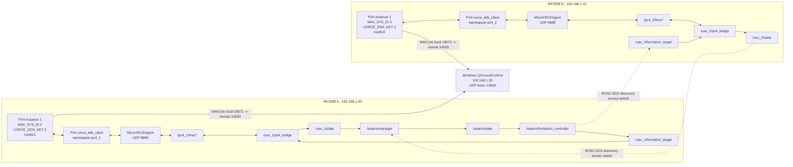

# PX4 / ROS2 / DDS 运行概念说明

本文记录当前项目里 PX4 SITL、MicroXRCE-DDS、ROS2 launch、bridge、swarm 节点和 QGC 之间的关系。

当前环境固定为 PX4 v1.14.4、ROS2 Humble、Gazebo Classic、MicroXRCEAgent 2.4.1。

## 1. PX4 rootfs 是什么

这里的 `rootfs` 不是 Ubuntu/RK3588 的 Linux 根文件系统，也不是开发板系统镜像。

PX4 SITL 每启动一个实例，都会给这个 PX4 进程准备一个独立运行目录，类似“这个虚拟飞控自己的小 SD 卡/工作目录”。

当前脚本中每个 instance 的目录是：

```text
/home/jie/PX4-Autopilot/build/px4_sitl_default/rootfs/<instance_id>
```

例如：

```text
instance 1 -> build/px4_sitl_default/rootfs/1
instance 2 -> build/px4_sitl_default/rootfs/2
```

里面常见内容：

```text
out.log
err.log
dataman
log/
parameters
```

作用：

- 隔离每个 PX4 SITL 实例的运行状态。
- 保存每个实例自己的参数、日志、dataman 等运行文件。
- 避免多架 SITL 共用同一个运行目录互相覆盖。

项目脚本启动 PX4 时会进入对应目录：

```bash
cd /home/jie/PX4-Autopilot/build/px4_sitl_default/rootfs/<instance_id>
/home/jie/PX4-Autopilot/build/px4_sitl_default/bin/px4 -i <instance_id> -d ...
```

## 2. PX4 instance、MAV_SYS_ID、UXRCE_DDS_KEY

PX4 SITL 的 `instance` 是 PX4 进程编号。

在 PX4 v1.14.4 的 `rcS` 中，多机 SITL 会自动执行：

```sh
param set MAV_SYS_ID $((px4_instance+1))
param set UXRCE_DDS_KEY $((px4_instance+1))
```

因此当前规则是：

```text
PX4 instance N -> MAV_SYS_ID N+1
PX4 instance N -> UXRCE_DDS_KEY N+1
```

例如：

```text
instance 1 -> MAV_SYS_ID 2 -> UXRCE_DDS_KEY 2
instance 2 -> MAV_SYS_ID 3 -> UXRCE_DDS_KEY 3
instance 3 -> MAV_SYS_ID 4 -> UXRCE_DDS_KEY 4
```

### MAV_SYS_ID

`MAV_SYS_ID` 是 MAVLink 包里的系统 ID 字段。QGC 通过它判断“这是哪一架飞机”。

它不是 UDP 端口号。

当前 GCS MAVLink 连接是每个 PX4 实例用不同的本地 UDP 端口，把数据都发到 Windows QGC 的同一个端口：

```text
PX4 instance 1 local UDP 18571 -> Windows 192.168.1.20:14550
PX4 instance 2 local UDP 18572 -> Windows 192.168.1.20:14550
PX4 instance 3 local UDP 18573 -> Windows 192.168.1.20:14550
```

QGC 收到的都是 `14550`，再根据 MAVLink 包里的 `MAV_SYS_ID` 区分飞机。

如果 A、B 两块板都启动 `PX4_INSTANCE_START=1`，两边都会产生 `MAV_SYS_ID=2`，QGC 就会把两架飞机当成同一个系统，表现为图标闪烁或状态交替覆盖。

### UXRCE_DDS_KEY

`UXRCE_DDS_KEY` 是 PX4 uXRCE-DDS client 的客户端标识。

它用于让 MicroXRCEAgent / DDS 侧区分不同 PX4 client。多机时每个 PX4 client 必须有不同 key，否则多个 PX4 可能在 DDS bridge 侧冲突。

它不等于 ROS2 namespace，也不等于 MAVLink 端口。当前 PX4 为了多机一致性，把它设置成和 `MAV_SYS_ID` 一样的 `instance + 1`。

## 3. `/px4_N/fmu/*` 是谁生成的

`/px4_N/fmu/*` 是 PX4 uXRCE-DDS client 在 DDS/ROS2 图中暴露出来的 PX4 原生话题。

PX4 v1.14.4 的 `rcS` 里有这段逻辑：

```sh
if [ "$px4_instance" -ne "0" ]
then
    uxrce_dds_ns="-n px4_$px4_instance"
fi

uxrce_dds_client start -t udp -h 127.0.0.1 -p 8888 $uxrce_dds_ns
```

所以：

```text
PX4 instance 1 -> uxrce_dds_client -n px4_1 -> /px4_1/fmu/*
PX4 instance 2 -> uxrce_dds_client -n px4_2 -> /px4_2/fmu/*
PX4 instance 3 -> uxrce_dds_client -n px4_3 -> /px4_3/fmu/*
```

这部分不是本项目 launch 文件创建的。它是 PX4 自己启动 uXRCE-DDS client 后，通过 MicroXRCEAgent 进入 ROS2 DDS 图的。

本项目 launch 做的是把 bridge 参数设置为对应的 `px4_topic_prefix`：

```text
uav_1 bridge 参数 px4_topic_prefix=px4_1
uav_2 bridge 参数 px4_topic_prefix=px4_2
uav_3 bridge 参数 px4_topic_prefix=px4_3
```

然后 bridge 才知道自己该订阅/发布哪一组 PX4 topic。

## 4. `/uav_N/px4_bridge` 是谁生成的

`/uav_N/px4_bridge` 是本项目 ROS2 launch 创建的节点 namespace。

在 `swarm_bringup/launch/swarm_px4_uxrce.launch.py` 中，每个 drone 会生成一个：

```python
Node(
    package="px4_bridge_uxrce",
    executable="px4_uxrce_bridge",
    namespace=namespace,
    name="px4_bridge",
)
```

所以：

```text
namespace=uav_1, name=px4_bridge -> /uav_1/px4_bridge
namespace=uav_2, name=px4_bridge -> /uav_2/px4_bridge
```

bridge 节点内部使用两套命名：

```text
项目内部 ROS2 namespace: /uav_N/...
PX4 原生 DDS topic prefix: /px4_N/fmu/...
```

例如 `uav_2`：

```text
/uav_2/px4_bridge
  订阅: /px4_2/fmu/out/vehicle_local_position
  订阅: /px4_2/fmu/out/vehicle_status
  订阅: /px4_2/fmu/out/timesync_status
  发布: /px4_2/fmu/in/vehicle_command
  发布: /px4_2/fmu/in/offboard_control_mode
  发布: /px4_2/fmu/in/trajectory_setpoint
  发布: /uav_2/state
  订阅: /uav_2/formation_target
  服务: /uav_2/arm, /uav_2/takeoff, /uav_2/land, /uav_2/hold, /uav_2/rtl, /uav_2/goto
```

## 5. launch 动态生成和 `config/swarm.yaml`

`swarm_px4_uxrce.launch.py` 有两种模式。

### `vehicle_count=0`

这是静态模式。launch 直接使用 `config/swarm.yaml` 中写死的 `swarm.drones`。

适合固定三机配置：

```bash
ros2 launch swarm_bringup swarm_px4_uxrce.launch.py
```

默认 `vehicle_count=0`，所以会使用配置文件中的：

```text
uav_1 -> px4_1 -> system_id 2
uav_2 -> px4_2 -> system_id 3
uav_3 -> px4_3 -> system_id 4
```

### `vehicle_count>0`

这是动态模式。launch 会先读取 `config/swarm.yaml` 作为模板，然后按参数生成临时 runtime config。

例如：

```bash
ros2 launch swarm_bringup swarm_px4_uxrce.launch.py \
  instance_start:=2 vehicle_count:=1
```

会生成：

```text
uav_2
namespace: uav_2
system_id: 3
px4_topic_prefix: px4_2
initial_position: 按 spawn_origin/spawn_spacing 生成
```

这时 `config/swarm.yaml` 仍然有用：

- 提供 `publish_rate_hz`。
- 提供 `state_timeout_sec`。
- 提供 `frame_id`。
- 提供 `uxrce_backend`，例如 `offboard_rate_hz`、`takeoff_altitude_m`。
- 提供第一架默认 `initial_position.z`，动态生成时沿用这个高度。
- 当 `vehicle_count=0` 时提供完整静态 drones 列表。

也就是说，动态启动不是“不用 config”，而是“不用 config 里固定写死的 drones 列表”。

## 6. 为什么 OffboardControlMode 和 TrajectorySetpoint 要持续发

PX4 的 Offboard 不是“发一个航点，然后 PX4 自己一直飞”的任务模式。

Offboard 的设计语义是：

```text
伴随计算机正在实时接管外部控制，并且持续在线。
```

所以 PX4 要求伴随计算机持续发送 setpoint 流。这个流同时有两个作用：

- 控制目标：告诉 PX4 当前要飞到哪里，或者当前速度/姿态目标是什么。
- 心跳证明：告诉 PX4 外部控制计算机还活着，链路没有断。

如果只发一次：

- PX4 不会把它当成一条完整航线。
- 进入 Offboard 前可能因为 setpoint 不足拒绝切换。
- 进入 Offboard 后如果 setpoint 流停止，PX4 会认为外部控制丢失，退出 Offboard 或触发 failsafe/hold。

当前 bridge 的逻辑是：

```text
收到 active FormationTarget
  -> 按 offboard_rate_hz 持续发布 OffboardControlMode
  -> 按 offboard_rate_hz 持续发布 TrajectorySetpoint
  -> warmup 若干次后发送 DO_SET_MODE 切 OFFBOARD
```

如果想“上传航线后让 PX4 自己飞”，那是 PX4 Mission 模式，不是当前项目的 Offboard 编队控制模式。当前 leader-follower 编队需要实时根据 leader 状态、队形、安全距离更新目标，所以必须持续发。

## 7. PX4 常见飞行模式

PX4 的飞行模式可以理解为“谁在给 PX4 位置/速度/姿态目标，以及 PX4 当前按什么逻辑执行”。

当前 `px4_bridge_uxrce` 会把 PX4 `VehicleStatus.nav_state` 转换成这些字符串：

```text
MANUAL
ALTCTL
POSCTL
AUTO_MISSION
AUTO_LOITER
AUTO_RTL
OFFBOARD
AUTO_TAKEOFF
AUTO_LAND
```

这些名字会出现在：

```bash
ros2 topic echo /uav_1/state --once
```

其中 `flight_mode` 字段就是 bridge 转出来的 PX4 当前模式。

### 本项目最相关的模式

| 模式 | 中文理解 | 谁给目标 | 当前项目中的作用 |
|---|---|---|---|
| `AUTO_TAKEOFF` | 自动起飞 | PX4 内部 takeoff 逻辑 | `/uav_N/takeoff` 服务会发送 takeoff 命令 |
| `OFFBOARD` | 外部控制 | ROS2 companion computer | 编队控制主模式，bridge 持续发 setpoint |
| `AUTO_LAND` | 自动降落 | PX4 内部 land 逻辑 | `/uav_N/land` 服务会发送 land 命令 |
| `AUTO_RTL` | 自动返航 | PX4 RTL 逻辑 | `/uav_N/rtl` 服务会发送 RTL 命令 |
| `AUTO_LOITER` | 自动悬停/定点等待 | PX4 loiter 逻辑 | `/uav_N/hold` 服务当前切到 loiter/hold |

当前推荐运行链路是：

```text
arm
  -> takeoff: PX4 进入 AUTO_TAKEOFF
  -> bridge 收到 active FormationTarget 并持续发送 setpoint
  -> bridge 发送 DO_SET_MODE
  -> PX4 进入 OFFBOARD
  -> formation_controller 持续更新 /uav_N/formation_target
  -> bridge 持续更新 /px4_N/fmu/in/trajectory_setpoint
```

### 手动/辅助类模式

| 模式 | 中文理解 | 说明 |
|---|---|---|
| `MANUAL` | 手动模式 | 主要依赖遥控器输入，SITL/无 RC 时一般不是当前项目主线 |
| `ALTCTL` | 高度控制 | PX4 稳定高度，水平控制更多依赖人工输入 |
| `POSCTL` | 位置控制 | PX4 利用定位保持/控制位置，通常是人工给速度/位置意图 |

这些模式更偏人工飞行或基础调试。本项目的集群控制不依赖它们。

### 自动任务类模式

| 模式 | 中文理解 | 说明 |
|---|---|---|
| `AUTO_MISSION` | 自动任务航线 | PX4 按上传到飞控的 mission item 自己飞 |
| `AUTO_LOITER` | 自动悬停 | PX4 在当前位置附近等待 |
| `AUTO_RTL` | 自动返航 | PX4 根据 RTL 参数返航、下降、降落或悬停 |
| `AUTO_LAND` | 自动降落 | PX4 执行降落 |
| `AUTO_TAKEOFF` | 自动起飞 | PX4 执行起飞 |

`AUTO_MISSION` 和 `OFFBOARD` 最大区别：

```text
AUTO_MISSION: 先把任务航点上传给 PX4，PX4 自己按 mission 执行。
OFFBOARD: ROS2 持续实时给 PX4 setpoint，PX4 持续检查外部控制流是否在线。
```

当前 leader-follower 编队是实时相对控制，所以使用 `OFFBOARD`，不是 `AUTO_MISSION`。

## 8. `/swarm/manager` 和 `/swarm/formation_controller` 为什么只跑一份

ROS2 使用 DDS 作为通信中间件。它不是 ROS1 那种必须依赖 master 的模型。

同一个 DDS 网络里，只要满足：

```text
ROS_DOMAIN_ID 相同
topic 名字相同
消息类型相同
QoS 能匹配
网络能互通
```

发布者和订阅者就能通过 DDS discovery 互相发现。

当前两块板都在同一个交换机下：

```text
A 板 192.168.1.40
B 板 192.168.1.41
Windows QGC 192.168.1.20
```

ROS2 DDS 图可以跨 A、B 两块板存在。也就是说，A 板上的 `/swarm/manager` 可以订阅 B 板 bridge 发布的 `/uav_2/state`，前提是 DDS discovery 能互相发现。

当前 `setup_env.sh` 没有显式设置 `ROS_DOMAIN_ID`。如果终端里也没有额外设置，ROS2 默认使用 domain 0，所以两块板默认在同一个 ROS2 DDS domain。

### 发现机制

简化理解：

```text
每个 ROS2 进程启动后，会在 DDS domain 里宣布：
  我有哪些 publisher
  我有哪些 subscriber
  我有哪些 service
  它们的 topic 名字、消息类型、QoS 是什么

DDS 收到其他节点的声明后，会自动匹配兼容的发布者和订阅者。
匹配成功后，消息就能跨进程、跨主机传输。
```

所以不需要在 `/swarm/manager` 里手动写 B 板 IP。它订阅的是 `/uav_2/state` 这个 ROS2 topic，DDS 负责在网络里找这个 topic 的发布者。

### 为什么 manager 只跑一份

`/swarm/manager` 是集群状态汇总者。它订阅：

```text
/uav_1/state
/uav_2/state
...
```

然后发布唯一的：

```text
/swarm/state
```

如果 A、B 两边各跑一份 manager，会出现：

```text
A manager 发布 /swarm/state：可能只知道 uav_1
B manager 发布 /swarm/state：可能只知道 uav_2
```

DDS 允许多个 publisher 发布同一个 topic，所以它不会报错。但 formation_controller 收到的 `/swarm/state` 会变成两份来源交替到达，状态可能一会儿完整、一会儿缺机，最终就会出现 hold 或 unhealthy。

### 为什么 formation_controller 只跑一份

`/swarm/formation_controller` 是集群目标生成者。它订阅：

```text
/swarm/state
```

然后发布：

```text
/uav_1/formation_target
/uav_2/formation_target
...
```

如果 A、B 两边各跑一份 controller，会出现两套控制器同时给同一架飞机发目标。DDS 不会自动帮你选“正确的那个”。bridge 只会看到 topic 上来了多个目标，控制权会混乱。

所以分布式运行时固定原则是：

```text
每架飞机一份 px4_bridge
整个集群一份 swarm_manager
整个集群一份 formation_controller
```

## 9. 为什么 `/px4_bridge` 要每架飞机各跑一份

`px4_bridge_uxrce` 是“单架 PX4”和“项目 ROS2 集群系统”之间的适配器。

每一架飞机都有自己的一组 PX4 topic：

```text
uav_1 bridge <-> /px4_1/fmu/*
uav_2 bridge <-> /px4_2/fmu/*
uav_3 bridge <-> /px4_3/fmu/*
```

每个 bridge 还要维护本机状态：

- 当前 PX4 local position。
- 当前 vehicle status。
- 当前 timesync。
- 当前 FormationTarget。
- 当前是否请求 Offboard。
- 当前 Offboard warmup 计数。
- 当前 `system_id`。
- 当前 `initial_position`。

这些状态天然是一机一份。

如果只跑一份 bridge 去管多架机，也可以设计成多机 bridge，但代码会复杂很多：一个节点要维护多套订阅、发布、状态机、服务和目标缓存。当前项目选择“一机一 bridge”，隔离更清楚，也更适合后续部署到每架无人机自己的 RK3588 伴随计算机上。

分布式两板推荐：

```text
A 板：
  PX4 instance 1
  MicroXRCEAgent
  /uav_1/px4_bridge
  /swarm/manager
  /swarm/formation_controller

B 板：
  PX4 instance 2
  MicroXRCEAgent
  /uav_2/px4_bridge
```

ROS2 DDS 网络把两边连成同一个逻辑 ROS2 图。

## 10. 当前整体数据流图



图里的虚线表示跨开发板的 ROS2 DDS 发布/订阅。只要两块板 `ROS_DOMAIN_ID` 相同、网络允许 DDS discovery 和数据流，A 板上的 `/swarm/manager` 与 `/swarm/formation_controller` 就可以直接订阅/发布 B 板上的 ROS2 topic。

QGC 这边不是 ROS2 DDS。所有飞机都可以发到 Windows `14550`，QGC 根据 MAVLink 包里的 `MAV_SYS_ID` 区分飞机。

## 11. 当前项目里最消耗算力的是哪部分

分两种情况看。

### 当前已经跑起来的 SITL/ROS2 编队链路

当前最吃算力的是：

```text
Gazebo Classic + PX4 SITL
```

原因：

- Gazebo 要跑物理仿真、模型插件、传感器插件、GPS/气压计/groundtruth 等仿真。
- 每架飞机都是一个 PX4 SITL 进程，PX4 内部还跑 EKF、控制器、mavlink、uXRCE-DDS client、日志等模块。
- 机数增加时，Gazebo 和 PX4 SITL 进程数量带来的 CPU 压力增长最快。

当前 ROS2 节点里相对更轻：

| 模块 | 默认频率 | 算力压力 |
|---|---:|---|
| `px4_bridge_uxrce` | state 10Hz，offboard 20Hz | 每机一份，中等偏轻 |
| `swarm_manager` | 5Hz | 很轻，只做状态汇总和超时判断 |
| `formation_controller` | 10Hz | 当前三机/少量无人机很轻 |
| `MicroXRCEAgent` | 随 PX4 topic 流量变化 | 中等，主要是消息转发 |

如果只看本项目自己写的 ROS2 代码，目前最核心、也最需要关注实时性的是：

```text
px4_bridge_uxrce 的 Offboard setpoint 发布
formation_controller 的目标生成
```

但它们当前还不是整套系统里最吃 CPU 的部分。真正占大头的是仿真侧。

### 机数增加后的压力排序

少量飞机时：

```text
Gazebo/PX4 SITL > MicroXRCEAgent/px4_msgs 流量 > px4_bridge_uxrce > formation_controller > swarm_manager
```

飞机数量很多时，`formation_controller` 的安全距离检查、邻机关系、队形目标生成可能从轻量变成明显负载。尤其如果后续做全连接避障，复杂度可能接近：

```text
O(N^2)
```

也就是每架飞机都和其他所有飞机比距离，40 架就是约 1600 组关系，100 架就是约 10000 组关系。

### 后续接入感知以后

后续如果接入目标检测、视觉、雷达、地图构建，算力大头会立刻变成：

```text
目标检测 / 图像推理 / 点云处理 / 建图
```

这会远大于当前的 `swarm_manager`、`formation_controller` 和普通 bridge。到真机 RK3588 部署时，感知节点、模型推理频率、图像分辨率和 NPU/GPU 使用方式会成为主要优化对象。

### 当前优化优先级

当前阶段优先关注：

- Gazebo 是否 headless，板端默认 `HEADLESS=1` 是对的。
- 不要一开始直接跑 40 架，先用 2-3 架确认链路。
- `offboard_rate_hz` 不要随意降太低，避免 PX4 Offboard 不稳定。
- `formation_controller` 的频率保持 10Hz 左右即可，不需要盲目提高。
- 真机部署时每架机只跑自己的 bridge，把全局 manager/controller 先集中跑一份。

## 12. 快速判断当前配置是否对齐

检查 PX4 原生 DDS topic：

```bash
ros2 topic list | grep '/px4_'
```

期望：

```text
/px4_1/fmu/out/vehicle_status
/px4_2/fmu/out/vehicle_status
```

检查项目 bridge：

```bash
ros2 node list | sort
```

期望：

```text
/uav_1/px4_bridge
/uav_2/px4_bridge
/swarm/manager
/swarm/formation_controller
```

检查 swarm 节点是否重复：

```bash
ros2 node list | sort | grep -E '/swarm/(manager|formation_controller)'
```

分布式两板时每个只能出现一次。

检查集群状态是否完整：

```bash
ros2 topic echo /swarm/state --once
```

应看到：

```text
drone_count: 2
drones:
  - drone_id: uav_1
  - drone_id: uav_2
```

检查目标是否激活：

```bash
ros2 topic echo /uav_1/formation_target --once
ros2 topic echo /uav_2/formation_target --once
```

正常飞行时应该是：

```text
active: true
```

如果是：

```text
active: false
source: formation_controller.hold:px4_state_unhealthy
```

优先检查：

- `/swarm/manager` 是否重复。
- `/swarm/formation_controller` 是否重复。
- `/swarm/state` 是否同时包含所有无人机。
- `PX4_INSTANCE_START` 和 ROS2 `instance_start` 是否一致。
- `MAV_SYS_ID`、`system_id`、`px4_topic_prefix` 是否按 `instance + 1` / `px4_N` 对齐。
