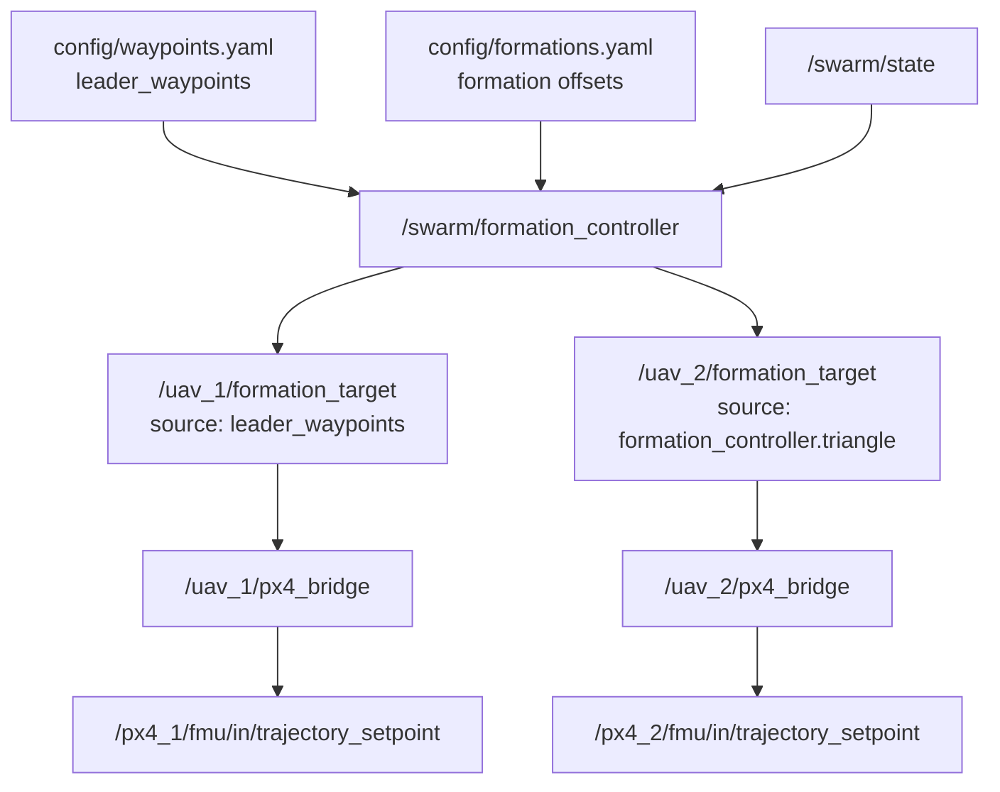

# 航点、出生偏移和频率参数说明

本文解释当前项目里 leader 航点、Gazebo 出生点、ROS2 `initial_position` 以及各类频率参数的关系。

重点结论：

- 一个 `formation_controller` 只有一个 `leader_id`。
- `config/waypoints.yaml` 里的航点是项目 `local_enu` 坐标系中的目标点。
- `PX4_SPAWN_X/Y` 是 Gazebo 里模型出生位置。
- ROS2 launch 的 `spawn_origin_x/y` 会生成 bridge 使用的 `initial_position`。
- `PX4_SPAWN_X/Y` 和 bridge 的 `initial_position` 必须一致，否则物理飞机会整体偏移。

## 1. 现在是不是所有 leader 都过同一套航点

当前项目的设计不是“很多 leader 都过同一套航点”。

当前每一份 `/swarm/formation_controller` 只有一个 leader：

```text
leader_id = uav_1
```

或者动态 launch 时：

```text
leader_id = uav_<instance_start>
```

在正确的两板分布式运行方式中：

```text
A 板 /swarm/formation_controller 只跑一份
leader_id = uav_1
uav_1 = leader
uav_2 = follower
```

也就是说：

```text
uav_1 按 config/waypoints.yaml 飞航点
uav_2 按 formation offset 跟随 uav_1
```

如果你在 A、B 两块板都完整启动了 `swarm_px4_uxrce.launch.py`，那就会变成两套互相独立的集群控制器：

```text
A 板 controller: leader_id = uav_1
B 板 controller: leader_id = uav_2
```

这种情况下，看起来就像“两个 leader 都在跑同一套航点”。这不是推荐的分布式集群方式。

推荐原则仍然是：

```text
每架飞机一份 px4_bridge
整个集群一份 swarm_manager
整个集群一份 formation_controller
```

## 2. 航点到底是什么坐标

当前 `config/waypoints.yaml`：

```yaml
leader_waypoints:
  frame: local_enu
  loop: true
  points:
    - [0.0, 0.0, 10.0]
    - [100.0, 0.0, 10.0]
    - [100.0, 100.0, 10.0]
    - [0.0, 100.0, 10.0]
```

这里的 `[100.0, 0.0, 10.0]` 不是经纬度，也不是 PX4 内部 NED 原点下的直接 setpoint。

它是项目统一坐标系 `local_enu`：

```text
x = east
y = north
z = up
单位 = m
```

`formation_controller` 读取这些点后，给 leader 发布：

```text
/uav_1/formation_target
source: formation_controller.leader_waypoints
position: [x, y, z]
```

然后 `px4_bridge_uxrce` 再把项目 ENU 坐标转换成 PX4 local NED setpoint。

## 3. 为什么你会看到 B 从 20 飞到 120

这里有三套值要分清：

| 名称 | 示例 | 谁使用 | 含义 |
|---|---:|---|---|
| `PX4_SPAWN_X` | `20` | Gazebo/PX4 SITL | 飞机模型在 Gazebo 里的出生 x |
| `initial_position.x` | `20` | `px4_bridge_uxrce` | bridge 认为这架飞机出生在项目 ENU 的 x |
| waypoint x | `100` | `formation_controller` | leader 目标航点 x |

bridge 发送给 PX4 的 local setpoint 会做一次减法：

```text
PX4 local target = waypoint - initial_position
```

飞机在 Gazebo/QGC 中最终看到的位置可以近似理解为：

```text
实际物理目标 = Gazebo出生位置 + PX4 local target
实际物理目标 = PX4_SPAWN_X + (waypoint - initial_position.x)
```

所以：

```text
如果 PX4_SPAWN_X = initial_position.x
实际物理目标 = waypoint
```

这就是理想情况。

### 对齐时

```text
PX4_SPAWN_X = 20
initial_position.x = 20
waypoint = 100
```

计算：

```text
PX4 local target = 100 - 20 = 80
实际物理目标 = 20 + 80 = 100
```

结果：

```text
B 从 20 飞到 100
```

### 不对齐时

```text
PX4_SPAWN_X = 20
initial_position.x = 0
waypoint = 100
```

计算：

```text
PX4 local target = 100 - 0 = 100
实际物理目标 = 20 + 100 = 120
```

结果：

```text
B 从 20 飞到 120
```

这就是你观察到的现象。

它不是航点自动变成了 `[20, 120]`，而是 Gazebo 出生点和 bridge 的 `initial_position` 没对齐，导致物理位置整体加上了出生偏移。

## 4. 正确启动时要让 PX4_SPAWN 和 ROS2 spawn 参数匹配

PX4/Gazebo 启动时：

```bash
PX4_INSTANCE_START=2 PX4_SPAWN_X=20 PX4_SPAWN_Y=3 \
  ./scripts/start_px4_multi_sitl.sh 1 iris
```

对应 B 板 bridge 启动时，也要让 launch 生成相同的 `initial_position`：

```bash
ros2 launch swarm_bringup swarm_px4_uxrce.launch.py \
  instance_start:=2 vehicle_count:=1 \
  enable_swarm_nodes:=false \
  spawn_origin_x:=20 spawn_origin_y:=3
```

如果 B 板 PX4 用的是：

```bash
PX4_INSTANCE_START=2 PX4_SPAWN_X=30 PX4_SPAWN_Y=3 \
  ./scripts/start_px4_multi_sitl.sh 1 iris
```

那么 B 板 bridge 也应该是：

```bash
ros2 launch swarm_bringup swarm_px4_uxrce.launch.py \
  instance_start:=2 vehicle_count:=1 \
  enable_swarm_nodes:=false \
  spawn_origin_x:=30 spawn_origin_y:=3
```

A 板同理：

```bash
PX4_INSTANCE_START=1 PX4_SPAWN_X=0 PX4_SPAWN_Y=3 \
  ./scripts/start_px4_multi_sitl.sh 1 iris
```

对应：

```bash
ros2 launch swarm_bringup swarm_px4_uxrce.launch.py \
  instance_start:=1 vehicle_count:=1 \
  enable_swarm_nodes:=false \
  spawn_origin_x:=0 spawn_origin_y:=3
```

最后只在 A 板启动一份集群节点：

```bash
ros2 launch swarm_bringup swarm_px4_uxrce.launch.py \
  instance_start:=1 vehicle_count:=2 \
  enable_bridges:=false enable_swarm_nodes:=true \
  spawn_origin_x:=0 spawn_origin_y:=3 \
  spawn_spacing_x:=30 spawn_spacing_y:=0
```

注意：最后这个集群节点 launch 里的 `spawn_origin/spawn_spacing` 主要用于生成 drone 列表、namespace、leader_id 等 runtime config。真正影响每架飞机 ENU/NED 转换的是各自 bridge 启动时拿到的 `initial_position`。

## 5. follower 和 leader 的目标区别

当前 `formation_controller` 的控制逻辑是：

```text
读取 /swarm/state
找到 leader_id 对应的 leader 状态
给 leader 发布 waypoints.yaml 中的航点目标
给 follower 发布 leader_position + formation_offset
```

Mermaid 关系图：



如果 `uav_2` 是 follower，它不会直接飞 `waypoints.yaml` 的点，而是飞：

```text
leader当前位置 + 当前队形 offset
```

如果你看到 `uav_2` 也像 leader 一样跑完整 waypoint，多半是 B 板也启动了自己的 `/swarm/formation_controller`，导致它把 `uav_2` 当成自己那套小集群的 leader。

## 6. 本项目涉及的频率都是什么意思

频率单位是 Hz：

```text
1 Hz = 每秒 1 次
10 Hz = 每秒 10 次
20 Hz = 每秒 20 次
```

频率越高，响应越快，但 CPU 和网络压力越大。

### `swarm.publish_rate_hz`

位置：

```yaml
config/swarm.yaml
swarm:
  publish_rate_hz: 5.0
```

作用：

```text
/swarm/manager 每秒发布多少次 /swarm/state
```

当前是 5Hz，也就是每秒汇总并发布 5 次集群状态。

它太低时，formation controller 看到的集群状态会变慢；太高时，对当前小规模系统意义不大。

### `uxrce_backend.state_rate_hz`

位置：

```yaml
config/swarm.yaml
uxrce_backend:
  state_rate_hz: 10.0
```

作用：

```text
每个 /uav_N/px4_bridge 每秒发布多少次 /uav_N/state
```

它把 PX4 的 `vehicle_local_position`、`vehicle_status` 等遥测整理成本项目的 `DroneState`。

当前是 10Hz，也就是每架飞机每秒发布 10 次状态。

### `uxrce_backend.offboard_rate_hz`

位置：

```yaml
config/swarm.yaml
uxrce_backend:
  offboard_rate_hz: 20.0
```

作用：

```text
每个 /uav_N/px4_bridge 每秒向 PX4 发布多少次 OffboardControlMode 和 TrajectorySetpoint
```

这是 PX4 Offboard 稳定性的关键频率。

当前是 20Hz：

```text
每秒 20 次 /px4_N/fmu/in/offboard_control_mode
每秒 20 次 /px4_N/fmu/in/trajectory_setpoint
```

不要随意降太低。PX4 用持续 setpoint 流判断外部控制是否在线，频率太低或中断会导致无法进入 Offboard 或退出 Offboard。

### `formation_controller.control_rate_hz`

位置：

```yaml
config/formations.yaml
controller:
  control_rate_hz: 10.0
```

作用：

```text
/swarm/formation_controller 每秒计算多少次 formation target
```

当前是 10Hz，也就是每秒计算 10 次：

```text
/uav_1/formation_target
/uav_2/formation_target
...
```

leader 的 waypoint 目标、follower 的编队目标、安全距离检查、速度前馈和平滑都在这个周期里做。

### `mavlink stream -r`

位置：

```text
PX4 px4-rc.mavlink
```

示例：

```sh
mavlink stream -r 50 -s GLOBAL_POSITION_INT -u $udp_gcs_port_local
mavlink stream -r 50 -s LOCAL_POSITION_NED -u $udp_gcs_port_local
```

作用：

```text
PX4 每秒向 QGC 发送多少次某类 MAVLink 状态消息
```

这个频率主要影响 QGC 显示刷新，不直接决定 ROS2 Offboard 控制频率。

### Gazebo / PX4 内部频率

Gazebo 物理仿真、PX4 EKF、姿态控制、位置控制等内部也有自己的频率。

这些频率当前不由本项目 YAML 直接控制。它们属于 PX4/Gazebo 内部运行机制。

本项目主要调的是 ROS2 侧频率：

```text
state_rate_hz
publish_rate_hz
control_rate_hz
offboard_rate_hz
```

## 7. 频率链路怎么串起来

```mermaid
flowchart LR
    PX4_OUT["PX4 /px4_N/fmu/out/*<br/>PX4内部遥测频率"]
    BRIDGE_STATE["px4_bridge state_timer<br/>state_rate_hz = 10Hz"]
    UAV_STATE["/uav_N/state"]
    MANAGER["swarm_manager<br/>publish_rate_hz = 5Hz"]
    SWARM_STATE["/swarm/state"]
    CONTROLLER["formation_controller<br/>control_rate_hz = 10Hz"]
    TARGET["/uav_N/formation_target"]
    BRIDGE_OFFBOARD["px4_bridge offboard_timer<br/>offboard_rate_hz = 20Hz"]
    PX4_IN["PX4 /px4_N/fmu/in/*<br/>OffboardControlMode + TrajectorySetpoint"]

    PX4_OUT --> BRIDGE_STATE
    BRIDGE_STATE --> UAV_STATE
    UAV_STATE --> MANAGER
    MANAGER --> SWARM_STATE
    SWARM_STATE --> CONTROLLER
    CONTROLLER --> TARGET
    TARGET --> BRIDGE_OFFBOARD
    BRIDGE_OFFBOARD --> PX4_IN
```



这里有一个看起来反直觉的点：

```text
formation_controller 是 10Hz
offboard_timer 是 20Hz
```

这意味着 controller 每秒更新 10 次目标，但 bridge 会把最新一次目标以 20Hz 持续喂给 PX4。

这样做是合理的：

- 上层队形目标不需要特别高频。
- PX4 Offboard setpoint 流需要稳定持续。
- 即使目标没有变，bridge 也要继续发最新目标，证明外部控制还在线。

## 8. 推荐频率设置

当前 2-3 架 SITL 推荐保持：

```yaml
swarm:
  publish_rate_hz: 5.0

uxrce_backend:
  state_rate_hz: 10.0
  offboard_rate_hz: 20.0

controller:
  control_rate_hz: 10.0
```

不要为了“更实时”盲目全调高。

优先级：

```text
offboard_rate_hz 保持稳定 > control_rate_hz 平稳 > state/publish 足够新鲜
```

如果后续飞机数量增加：

- `offboard_rate_hz` 尽量保持 20Hz 左右。
- `control_rate_hz` 可以先保持 10Hz。
- `swarm.publish_rate_hz` 可以保持 5Hz，除非状态明显滞后。
- 真正要优化时，先看 CPU、DDS 延迟、Gazebo 实时率，而不是只改 YAML。

## 9. 快速排查你看到的 20 到 120 问题

检查 PX4/Gazebo 启动参数：

```bash
ps -ef | grep start_px4_multi_sitl
```

或看启动终端中：

```text
Spawn origin: x=...
Spawn step: x=...
```

检查 bridge 生成的 `initial_position` 最直接的方法是看启动命令是否传了匹配的：

```text
spawn_origin_x
spawn_origin_y
```

也可以看 `/uav_N/state` 起飞前的位置：

```bash
ros2 topic echo /uav_2/state --once
```

如果 B 板 Gazebo 出生 `PX4_SPAWN_X=20`，但起飞前 `/uav_2/state.position.x` 接近 `0`，说明 bridge 的 `initial_position.x` 没对齐。

正确时应该接近：

```text
position.x: 20
```

如果起飞前状态已经错了，后面的 waypoint 就会整体错。
